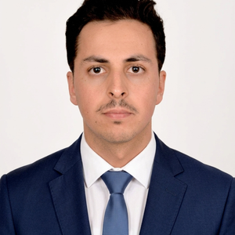
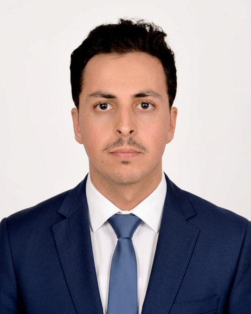

---
hide:
  - toc
  - navigation
---
<!--
CHECKLIST FOR THIS PAGE:
- [ ] Replace [YOUR NAME] with your full name (3 places)
- [ ] Replace [YOUR JOB TITLE] with your current or target role
- [ ] Replace [YOUR TAGLINE] with a short phrase describing your focus
- [ ] Rewrite the About Me paragraph with your own words
- [ ] Replace assets/images/profile.png with your actual photo (keep the filename or update it below)
- [ ] Replace assets/images/about.png with your own image (a field photo, map, or workspace shot)
- [ ] Edit the skill cards to match your actual skills (add, remove, or rename cards as needed)
- [ ] Update GitHub and LinkedIn links in the Connect section
- [ ] Add your CV PDF to docs/assets/ and update the filename in the Download CV button
-->

  
  <h1>Abderrahman El Farchouni</h1>
  
<strong>PhD Researcher in Integrated Hydrology & Groundwater Recharge</strong>

  
<strong>Mohammed VI Polytechnic University (UM6P – IWRI) & University of Florence (UNIFI – DAGRI)</strong>

  
<em>Connecting field evidence, geospatial data, and models for groundwater sustainability.</em>

  <svg class="hero-wave" viewBox="0 0 1440 60" preserveAspectRatio="none" aria-hidden="true"><path d="M0,36 C240,64 480,8 720,24 C960,40 1200,52 1440,28 L1440,60 L0,60 Z"></path></svg>

:material-flask: **5 peer-reviewed publications**

:material-trophy: **Best Poster Award, EUniWell Workshop 2025**

:material-earth: **Morocco–Italy cotutelle PhD**

---

## About Me

I am a PhD researcher working at the intersection of hydrology, hydrogeology, geospatial
science, and data-driven modeling. I am completing a cotutelle doctorate between the
International Water Research Institute at Mohammed VI Polytechnic University in Morocco and
the Department of Agriculture, Food, Environment and Forestry at the University of Florence
in Italy.

My research investigates how groundwater is recharged, stored, and affected by environmental
change in semi-arid regions. Using the Haouz–Mejjate aquifer system as a principal case study,
I am developing an integrated SWAT–MODFLOW modeling framework to quantify recharge and assess
the effects of climate variability and land-use/land-cover dynamics. I connect model
development with field evidence from hydrogeophysics, groundwater monitoring, hydrochemistry,
and stable isotopes, as well as satellite observations and machine-learning methods.

My broader goal is to turn multidisciplinary environmental data into defensible hydrogeological
understanding and practical evidence for sustainable water governance. I am interested in
research collaborations involving groundwater recharge, integrated modeling, Earth observation,
GeoAI, and water-resource decision support.

  

---

[View My Projects :material-arrow-right:](projects/index.md){ .md-button .md-button--primary }
[Download CV :material-download:](assets/Abderrahman-El-Farchouni-CV.pdf){ .md-button }

---

## Skills

-   :material-water:{ .lg .middle } **Hydrological & Hydrogeological Modeling**

    ---

    - SWAT / SWAT+ and MODFLOW for integrated surface–groundwater modeling
    - GMS for groundwater flow modeling
    - GW Vistas
    - Model calibration and uncertainty analysis

-   :material-test-tube:{ .lg .middle } **Hydrochemistry & Isotopes**

    ---

    - Major-ion groundwater chemistry and water quality interpretation
    - Stable isotope tracing of groundwater recharge (δ²H, δ¹⁸O)
    - Hydrogeochemical diagrams and multivariate analysis
    - Sampling design, collection, and lab analysis

-   :material-satellite-variant:{ .lg .middle } **Remote Sensing & GIS**

    ---

    - Google Earth Engine for large-scale geospatial analysis (LULC, NDVI/NDWI, evapotranspiration, recharge mapping)
    - ArcGIS, QGIS for spatial analysis, interpolation, and cartography
    - Satellite data processing (Sentinel-2, Landsat, CHIRPS, WaPOR, TerraClimate, SMAP, GPM)

-   :material-magnet:{ .lg .middle } **Geophysics & Field Methods**

    ---

    - ERT, Magnetic Resonance Sounding (MRS), seismic surveys, EM38
    - Pumping tests and piezometric monitoring
    - Isotopes (δ²H, δ¹⁸O) and hydrochemistry sampling
    - Prodiviner, Res2DInv

-   :material-code-braces:{ .lg .middle } **Programming & Data Science**

    ---

    - Python: pandas, scikit-learn, TensorFlow, Xarray, matplotlib
    - Machine learning & deep learning: KNN, Random Forest, LSTM, GAIN, PINN
    - R for statistical and hydrogeochemical analysis (PCA, clustering)
    - SQL & SQLite for database management

-   :material-file-document-edit:{ .lg .middle } **Scientific Communication**

    ---

    - LaTeX for academic writing and reports
    - Adobe Illustrator for publication-quality figures
    - Microsoft Office Suite

-   :material-translate:{ .lg .middle } **Languages**

    ---

    - Arabic (Native)
    - French (Fluent)
    - English (Fluent)

---

## Connect

[GitHub](https://github.com/ElFarchouni){ .md-button }
[LinkedIn](https://www.linkedin.com/in/abderrahman-el-farchouni){ .md-button }
[Email](mailto:elfarchouniabderrahman7@gmail.com){ .md-button }
