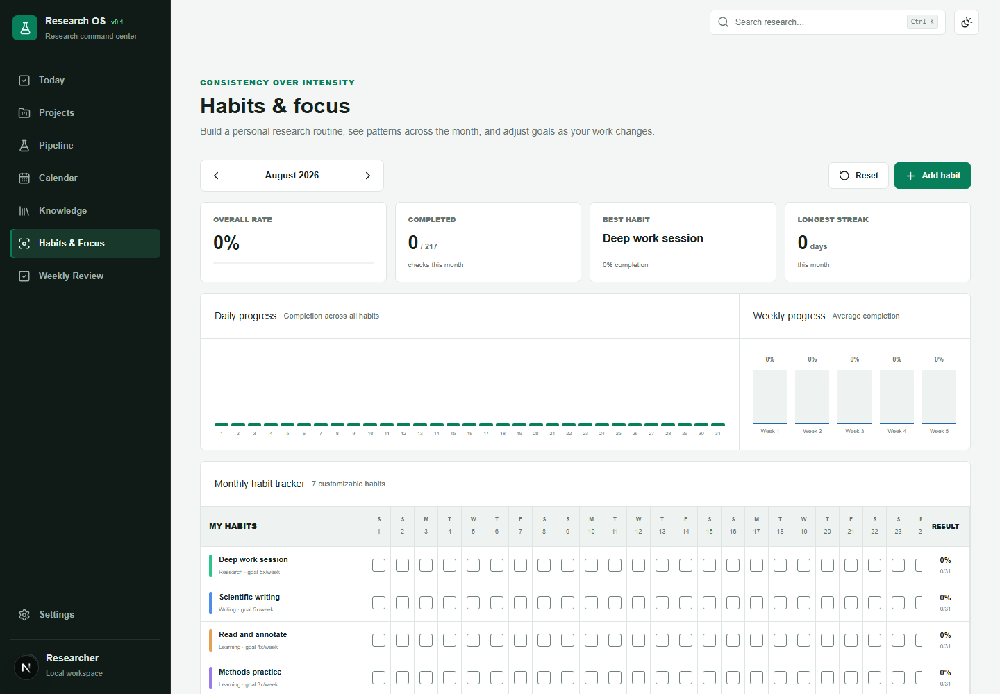
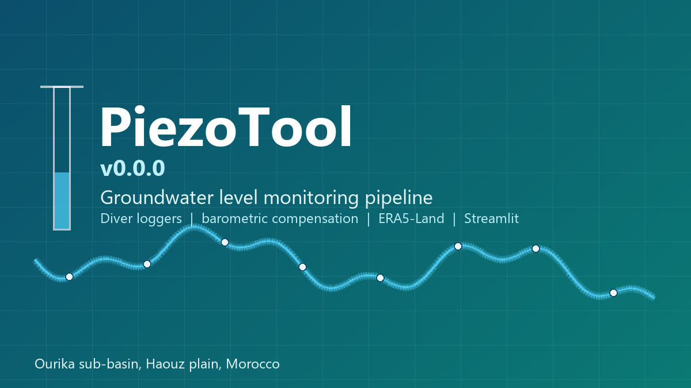

---
hide:
  - toc
  - navigation
---
<!--
CHECKLIST FOR THIS PAGE:
- [ ] Replace the two placeholder cards (marked [YOUR PROJECT ...]) with your real projects
- [ ] For each project: add a thumbnail image to docs/assets/images/ and update the path below
- [ ] For each project: create a project page by copying sample-project.md
- [ ] For each project: add a nav entry in mkdocs.yml (see the comments there)
- [ ] Delete placeholder cards you don't need yet
-->

# Projects

A selection of my research projects. Click any card to see the full write-up.

Open source · v0.1

**[Research OS](research-os.md)**

**Consistency wins.** A privacy-first operating system connecting the daily practices of
research with projects, evidence, deadlines, habits, and meaningful scientific outputs.

`Next.js` `TypeScript` `PWA` `Local-first` `Docker`

[View Project →](research-os.md){ .md-button }

Ongoing

**[PiezoTool v0.0.0](piezotool.md)**

End-to-end pipeline turning raw Diver pressure-logger records from a piezometer network in
the Haouz plain (Morocco) into validated groundwater levels, with a no-code processing tool for
the field team and an interactive map-and-chart console.

`Python` `Streamlit` `Google Earth Engine` `Leaflet`

[View Project →](piezotool.md){ .md-button }

